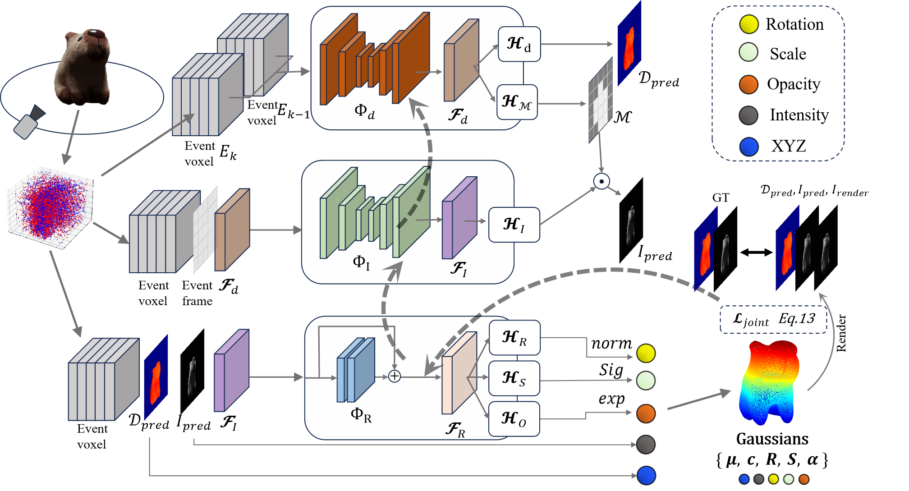

# EvGGS: A Collaborative Learning Framework for Event-based Generalizable Gaussian Splatting
[A Collaborative Learning Framework for Event-based Generalizable Gaussian Splatting](https://arxiv.org/abs/2405.14959v1) 

Jiaxu Wang, Junhao He, Ziyi Zhang, Mingyuan Sun, Jingkai Sun, Renjing Xu*

<p align="center">
<br>
Fig  1. The overview of EvGGS.
</p>

# Create environment
```
conda env create --file environment.yml
conda activate evggs
```

# Download models
Download the pretrained models and be expected at ```event-flow/mlruns/```

# Training and Testing
```
python <path-to-your-code>/ddp_train_nerf.py --config <path-to-your-code>/configs/*.txt
python <path-to-your-code>/ddp_test_nerf.py --config <path-to-your-code>/configs/*.txt
```

# Dataset

- Ev3D-S

    a large-scale synthetic Event-based dataset with varying textures and materials and accompanied by well-calibrated frame, depth, and silhouette groundtruth.

    Download the dataset from OneDrive...


- EV3D-R

    A large Event-based 3D dataset captured by a real event camera of EvGGS

    Download the dataset from [Baidu Disk](https://pan.baidu.com/s/1EuR-l_b_g-j_Du6dOxtZEg?pwd=3ilt ), code:3ilt

    Download the dataset from [OneDrive](https://hkustgz-my.sharepoint.com/:u:/g/personal/junhaohe_hkust-gz_edu_cn/EY__SmcUSbdFs13sb2h8svYBXYOCDd0OVnSWV-WLfvFLmA?e=GkVjhd)

- Custom Dataset Instructions
    You can construct your custom datasets by the following steps:

    1. Render the scenario in Blender:
        - Put the object in the origin and let the camera trace bounded by a unit sphere.
        - The groundtruth pose, depth, and optical flow are generated by VisionBlender. 
    2. Record the event stream using your event cameras or convert the RGB image series using the [event converter V2E](https://github.com/SensorsINI/v2e)
    3. Align the groundtruth poses, depth, optical flows, and grayscale images with event streams.
    4. Dataset formats:
        - H5_Files: The aligned event streams stored in H5 files
        - Render_info: Grayscale images and .npz files which contain poses, depth, and optical flows.
        - Intrinsics: Camera intrinsics

Please contact us if you need to construct your custom event datasets.

# Citation

please cite our work if you use this dataset.

```
@misc{wang2024evggscollaborativelearningframework,
      title={EvGGS: A Collaborative Learning Framework for Event-based Generalizable Gaussian Splatting}, 
      author={Jiaxu Wang and Junhao He and Ziyi Zhang and Mingyuan Sun and Jingkai Sun and Renjing Xu},
      year={2024},
      eprint={2405.14959},
      archivePrefix={arXiv},
      primaryClass={cs.CV},
      url={https://arxiv.org/abs/2405.14959}, 
}
}
```
